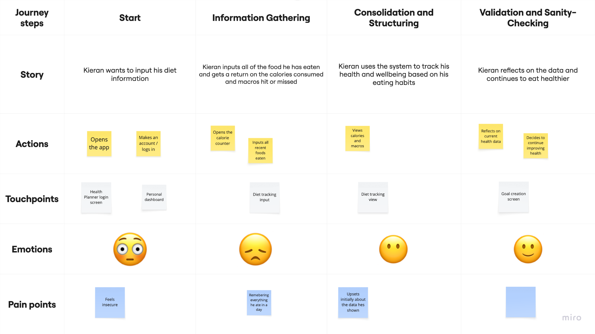
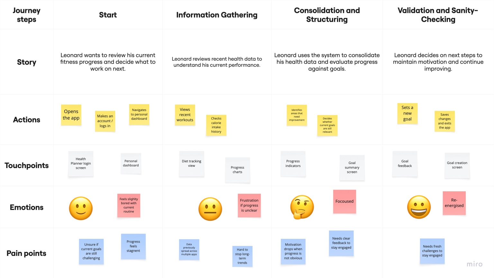
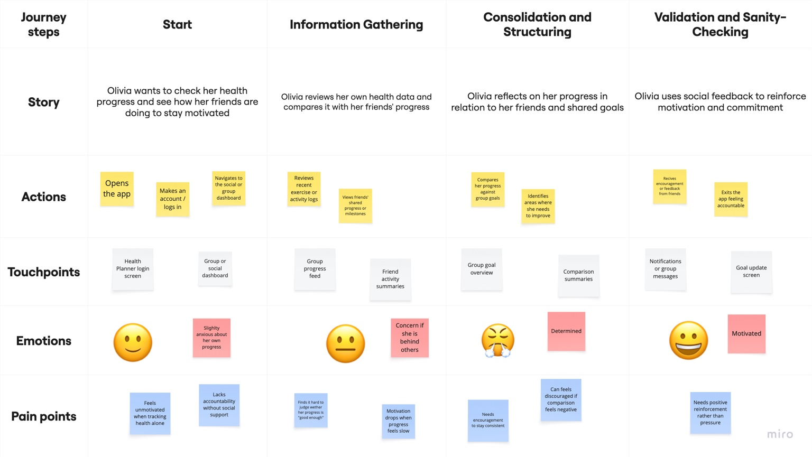

# User Journeys

Export your user journey diagrams from Miro to `/design` and link them here.

## Journey 1: [Kieran]

This journey represents a busy parent using the Health Planner to become more aware of diet and gradually build healthier habits without feeling overwhelmed.

- Entry point: Kieran opens the Health Planner to better understand his daily eating habits.
- Key steps: 
	•	Logs into the system and reviews his existing health profile
	•	Records food and drink consumed throughout the day
	•	Receives feedback highlighting patterns such as frequent snacking
	•	Sets a small, achievable health goal related to diet or weight
	•	Reviews progress over time through simple history views
- Expected outcome: Kieran gains clearer insight into his eating habits and feels supported in making gradual, realistic improvements to his health.

## Journey 2: [Leonard]

This journey shows a highly engaged user using the system to consolidate health data and maintain motivation after reaching previous goals.

- Entry point: Leonard logs into the Health Planner as part of his daily fitness routine.
- Key steps:
	•	Records exercise sessions and calorie intake
	•	Reviews historical trends across workouts, diet and weight
	•	Checks progress against existing fitness goals
	•	Receives system feedback indicating goals have been met
	•	Sets new or more challenging goals to maintain motivation
- Expected outcome: Leonard can clearly see long-term progress in one place and remains motivated by setting new fitness targets.

## Journey 3: [Olivia]

This journey focuses on a socially motivated user who relies on shared progress and accountability to stay engaged.

- Entry point: Olivia opens the Health Planner to check her progress and see how her friends are doing.
- Key steps:
	•	Logs health activities such as exercise or weight updates
	•	Views shared group progress or goal achievements
	•	Compares progress with friends in a supportive way
	•	Receives encouragement through shared milestones
	•	Continues tracking to avoid falling behind group goals
- Expected outcome: Olivia feels accountable and motivated by shared progress, helping her stay engaged with her health goals.